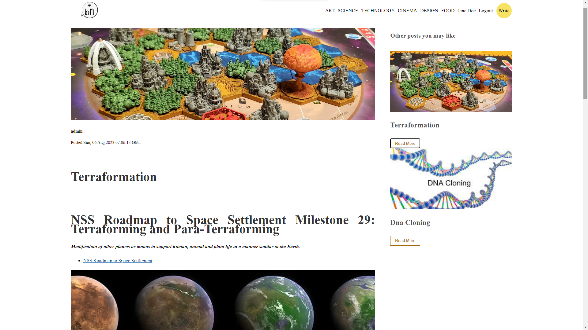
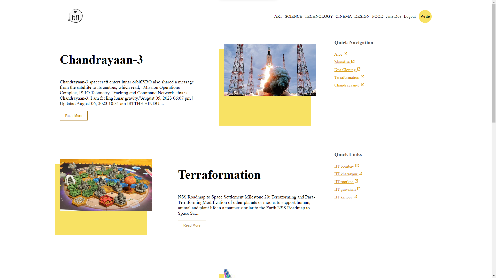
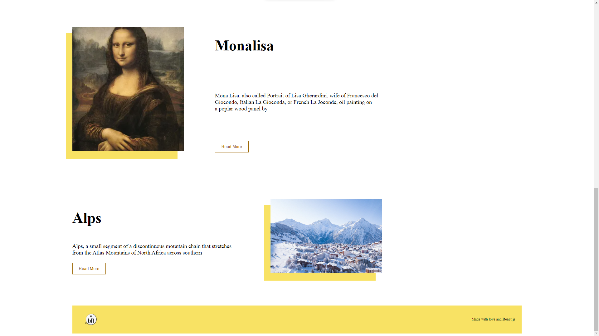
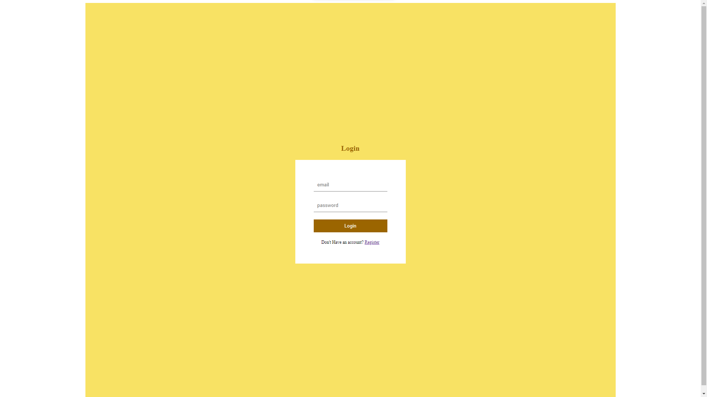
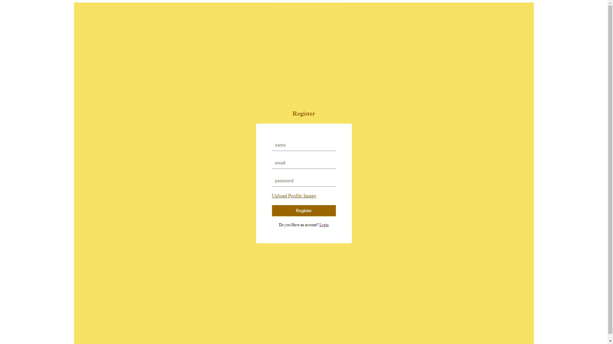
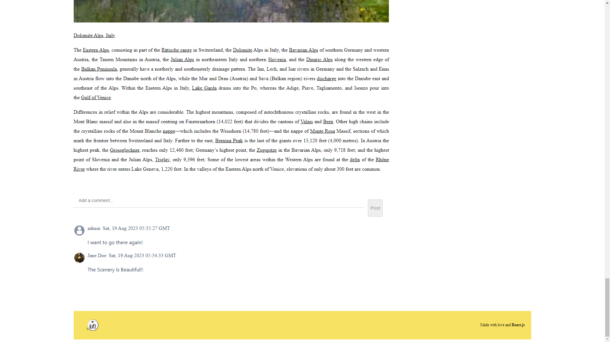
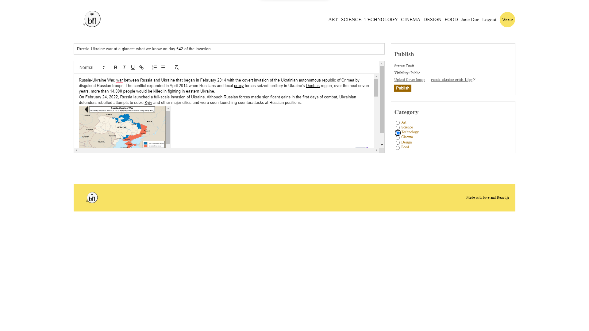
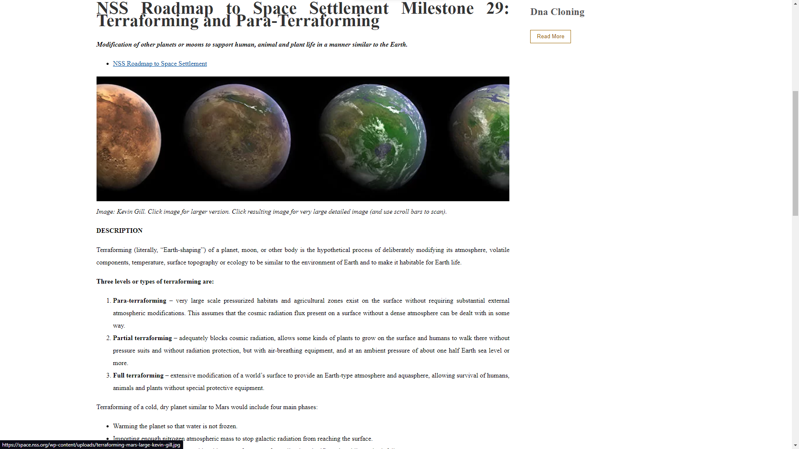
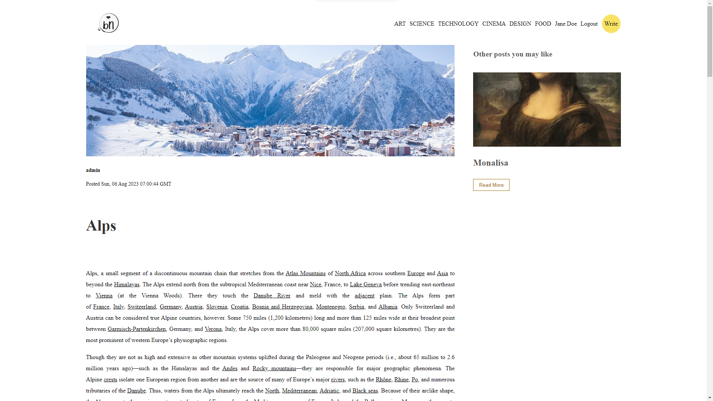

# BlogNetwork

A blog writing website built with react.js, python flask and mongoDB

## Table of Contents

- [Overview](#overview)
- [Features](#features)
- [Installation](#installation)
- [Usage](#usage)
- [Contributing](#contributing)
- [License](#license)
- [UI Showcase](#ui-showcase)
- [Endpoints Documentation](#endpoints-documentation)

## Overview

BlogNetwork is a comprehensive blogging platform designed to bring writers and readers together in a seamless environment. Built with the power of React.js for the frontend, Python Flask for the backend, and MongoDB as the database, it offers a robust and scalable solution for content creators and enthusiasts.

Whether you're an individual looking to share your thoughts, a professional showcasing your expertise, or simply a reader in search of quality content, BlogNetwork provides a user-friendly interface to cater to your needs. With features like user registration, article categorization, and the ability to add images to articles, it ensures a rich and interactive blogging experience.

The platform's responsive design ensures that users have a consistent experience across devices, making it easy to write, read, and interact on the go. Additionally, with its open-source nature, developers can contribute, customize, and enhance the platform to suit specific requirements.

Join us on this journey and be a part of the BlogNetwork community, where every story matters!

## Features

Main features of your application:
- User registration and login
- Writing articles
- Categorizing articles
- Adding images to articles

## Prerequisites

Before getting started, make sure you have the following prerequisites installed:

- Python 3.x: You can download Python from the official website: https://www.python.org/downloads/
- Node.js and npm: You can download Node.js from the official website: https://nodejs.org/
- MongoDB You can download mongoDB from the official website: https://www.mongodb.com/try/download/community

## Installation

Instructions on how to install and set up the project locally. First of all make sure mongoDB is installed and running properly on your local machine.

1. Clone the repository:<br>
  ```
  git clone https://github.com/Gourav2000/BlogNetwork
  ```
2. Install dependencies for the Flask backend:<br>
  ``` 
  cd backend
  pip install -r requirements.txt 
  ```
3. Start the Flask backend:
```
flask run
```
3. Install dependencies for the React frontend:
```
cd ../frontend
npm install --force
```
5. Start the React frontend:
```
npm start
```

Alternatively You can download and install docker from the official website https://docs.docker.com/engine/install/ for your respective OS. Then Type
```
docker-compose up
```
For setting up the whole project in a single command.

## Usage

**BlogNetwork** is designed to be user-friendly and intuitive. Here's a guide to help you get started with the platform:

### 1. **Registration and Login**
- If you're new to **BlogNetwork**, start by registering an account by navigating to the `Register` page.
- Provide your name, email, and a secure password.
- If you already have an account, simply log in using your email and password on the `Login` page.

### 2. **Writing a New Post**
- Once logged in, head to the `Write` page.
- Fill in the post title, content, and choose a relevant category.
- You can also upload a cover image to make your post visually appealing.
- Click on the `Publish` button to make your post live.

### 3. **Reading and Interacting with Posts**
- The `Home` page displays a list of all available posts.
- Click on a post title to read it in detail.
- You can also leave comments on posts to engage with the author and other readers.

### 4. **Managing Your Profile**
- Navigate to the `Profile` page to view and manage your personal details.
- You can update your name, email, profile picture, and even view a list of all your posts.
- If needed, you can also delete your profile from this page.

### 5. **Logging Out**
- Once you're done, you can log out of your account from the top-right corner of the platform.

---

Remember, **BlogNetwork** is a community-driven platform. We encourage positive interactions and sharing of quality content. Happy blogging!


## Contributing

We warmly welcome contributions to **BlogNetwork**! Whether you're fixing bugs, enhancing documentation, or suggesting new features, your efforts and expertise are invaluable. Here's a step-by-step guide on how you can contribute:

### Step 1: Fork the Repository

Begin by forking the [BlogNetwork repository](https://github.com/Gourav2000/BlogNetwork) to your own GitHub account.

### Step 2: Clone the Forked Repository

After forking, clone your forked repository to your local machine:
```
git clone https://github.com/YOUR_USERNAME/BlogNetwork.git
```

### Step 3: Create a New Branch

Before making any modifications, create a new branch:
```
git checkout -b name-of-your-new-branch
```
### Step 4: Implement Your Changes

Make your desired changes, improvements, or fixes within this branch.


### Step 5: Commit and Push Your Changes

Once you're satisfied with your modifications:
```
git add .
git commit -m "Briefly describe your changes here"
git push origin name-of-your-new-branch
```

### Step 6: Submit a Pull Request

Navigate to the [BlogNetwork repository](https://github.com/Gourav2000/BlogNetwork) on GitHub and create a new pull request from your branch.

### Step 7: Address Review Feedback

Our maintainers will review your pull request. Please address any feedback or comments to ensure your changes are merged.

**Code of Conduct:**  
We expect all contributors to respect our code of conduct. Ensure your interactions within the community are considerate, inclusive, and adhere to open-source best practices.

---

A huge thank you for considering contributing to **BlogNetwork**! Your dedication helps enhance this platform for everyone.

## License

**BlogNetwork** is licensed under the MIT License. This means you are free to use, modify, and distribute the project, as long as you include the original copyright and license notice in any copy of the software/source.

The details of the MIT License provide clear information about what you can and cannot do with the software. In essence, the MIT License is a permissive license, allowing for reuse in proprietary and free projects.

For the full license text, please refer to the [MIT License](https://opensource.org/licenses/MIT) on the Open Source Initiative's website.

---

**Note:** While the software is licensed under the MIT License, it's important to remember that any content (e.g., blog posts, images) created by users on the platform may have its own licensing and copyright terms. Always ensure you have the right to use or distribute such content.


## UI Showcase

### Blog Single Page & Home Page
<table>
<tr>
<td></td>
<td></td>
</tr>
</table>

### Home Page 2 & Login Page
<table>
<tr>
<td></td>
<td></td>
</tr>
</table>

### Register Page & Write Blog Comments Page
<table>
<tr>
<td></td>
<td></td>
</tr>
</table>

### Write Blog Page & Write Blog Page 2
<table>
<tr>
<td></td>
<td></td>
</tr>
</table>

### Write Blog Page 3


## Endpoints Documentation

---

### **1. Home Page**
**Path:** `/`
- Displays a list of all posts.
- Each post showcases its title, a brief description, and an image.
- Posts can be filtered based on categories.
- Quick navigation links are provided for easy access to posts.

#### Endpoint: `/`
- **Method:** `GET`
- **Description:** Fetches and displays all posts on the home page.

---

### **2. Single Post Page**
**Path:** `/post/:id`
- Displays a single post based on the provided post ID.
- Shows post title, content, and image.
- Displays the author's details.
- Allows users to comment on the post.

#### Endpoint: `/post/:id`
- **Method:** `GET`
- **Parameters:** 
  - `id`: ID of the post to be fetched.
- **Description:** Fetches and displays a single post based on the provided post ID.

---

### **3. Write or Edit Post Page**
**Path:** `/write`
- Allows users to write a new post or edit an existing post.
- Users can add a title, content, and choose a category for the post.
- Provides an option to upload a cover image for the post.

#### Endpoint: `/write`
- **Method:** `POST` (for new posts) / `PUT` (for updating existing posts)
- **Description:** Allows users to write a new post or edit an existing post.

---

### **4. Profile Page**
**Path:** `/profile`
- Displays the profile details of the logged-in user.
- Shows user's name, email, and profile picture.
- Provides options to edit profile details or delete the profile.

#### Endpoint: `/profile`
- **Method:** `GET`
- **Description:** Fetches and displays the profile details of the logged-in user.

---

### **5. Login Page**
**Path:** `/login`
- Allows users to log in using their email and password.
- Provides a link to the registration page for new users.

#### Endpoint: `/login`
- **Method:** `POST`
- **Parameters:**
  - `email`: Email of the user.
  - `password`: Password of the user.
- **Description:** Authenticates and logs in the user.

---

### **6. Register Page**
**Path:** `/register`
- Allows new users to register by providing their name, email, and password.
- Provides an option to upload a profile picture.

#### Endpoint: `/register`
- **Method:** `POST`
- **Parameters:**
  - `name`: Name of the user.
  - `email`: Email of the user.
  - `password`: Password of the user.
- **Description:** Registers a new user.

---


